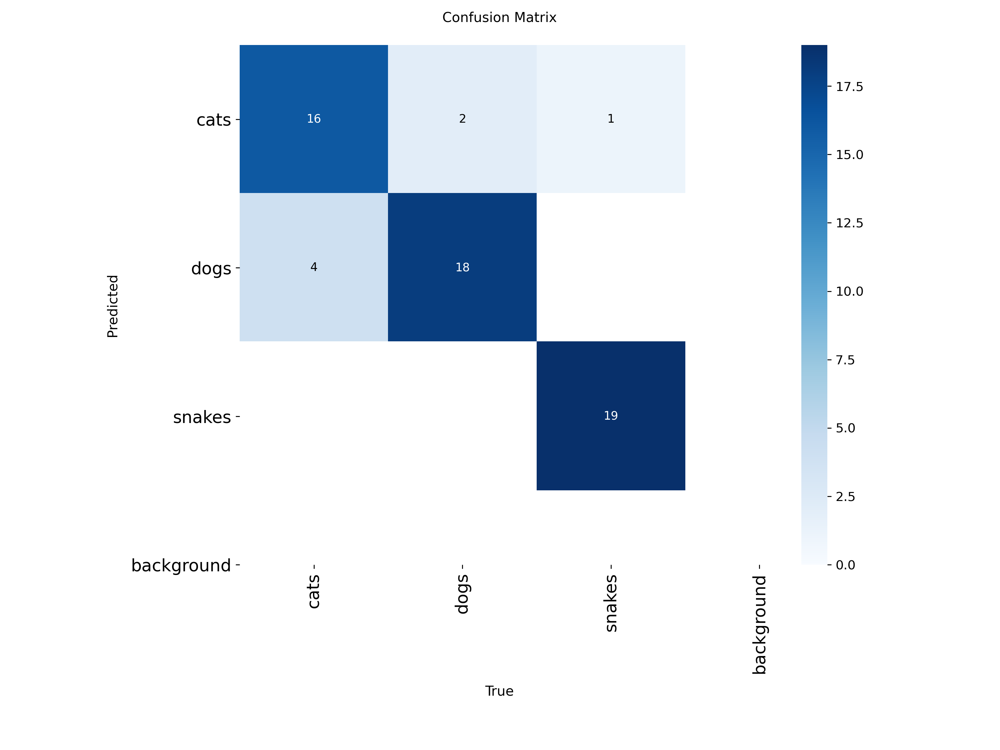
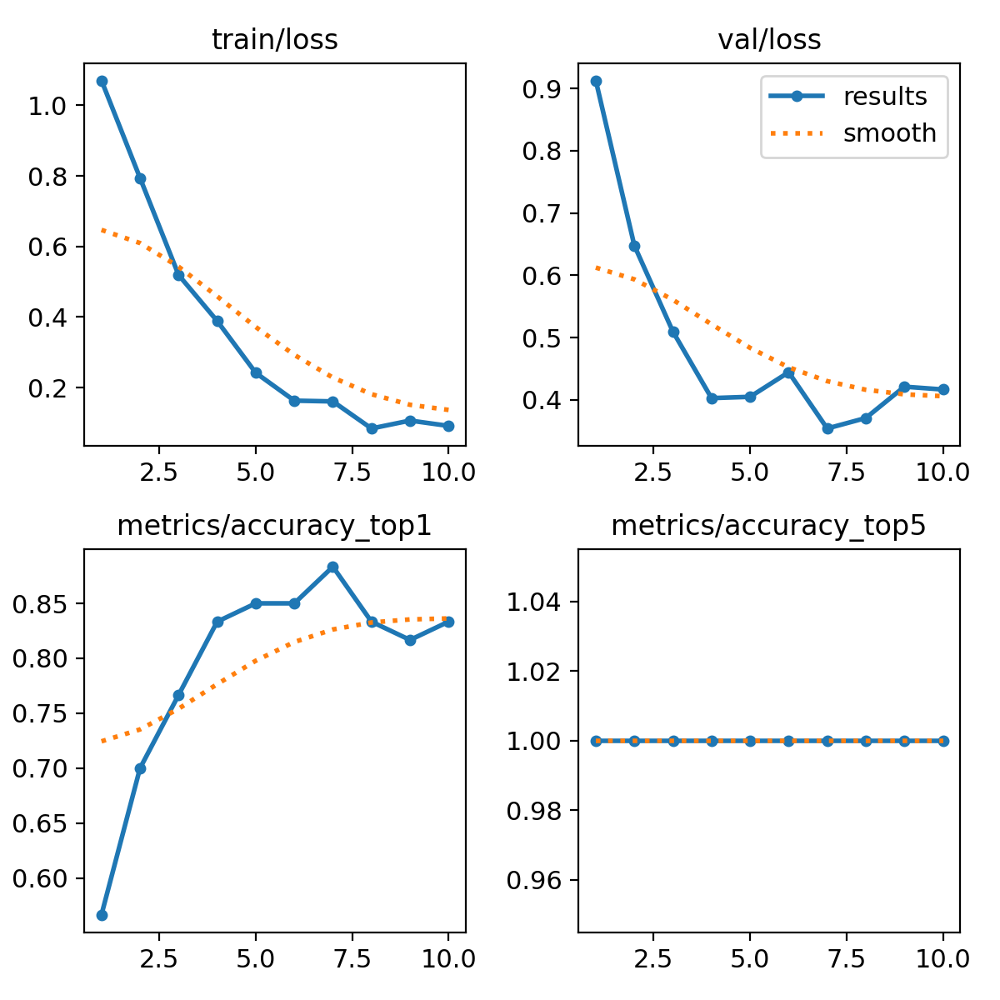

# Animal Image Classification with YOLO11s

## Project Overview
This project implements an animal image classification model using the YOLO11s-cls architecture from Ultralytics. The model is trained to classify images into three categories: **cats**, **dogs**, and **snakes**. The dataset is a custom collection of images, and the training was performed using the Ultralytics YOLO framework.

## Dataset
The dataset is a custom collection of images for animal classification, organized into training, validation, and test sets:
- **Training Set**: 120 images across 3 classes (cats, dogs, snakes).
- **Validation Set**: 60 images across 3 classes.
- **Test Set**: 30 images for inference.
- **Path**: Stored at `/content/drive/MyDrive/Animal Classification/custom_dataset` (update this path based on your setup).
- **Image Size**: All images are resized to 640x640 pixels during training and inference.

**Note**: The dataset is not included in this repository. Users must provide their own dataset with a similar structure (train and validation folders with subfolders for each class).

## Model
- **Architecture**: YOLO11s-cls (pretrained weights: `yolo11s-cls.pt`).
- **Parameters**: 5,437,971 (after fusion).
- **Training Configuration**:
  - Epochs: 5
  - Batch Size: 16
  - Optimizer: AdamW (learning rate: 0.001429, momentum: 0.9)
  - Hardware: CPU (Intel Xeon 2.00GHz)
  - Image Size: 640x640
- **Output Directory**: Training results and weights are saved in `runs/classify/train3`.

## Training Results
The model was trained for 5 epochs, achieving the following performance on the validation set:
- **Best Top-1 Accuracy**: ~88% (Epoch 2)
- **Top-5 Accuracy**: 100% (expected, as there are only 3 classes)
- **Training Time**: ~5 minutes
- **Loss Trend**: Decreased from 1.07 (Epoch 1) to 0.3124 (Epoch 5)

The best model weights are saved at `runs/classify/train3/weights/best.pt`.

### Results Visualization
- **Confusion Matrix**:
  The confusion matrix for the validation set is shown below, illustrating the model's performance across the three classes.
  

  The normalized confusion matrix provides a clearer view of the classification performance relative to class sizes.
  

- **Training Metrics**:
  The training and validation metrics (e.g., loss, accuracy) are visualized in the results plot.
  

## Inference
The trained model was tested on 30 images from the test set. Key observations:
- Most predictions have high confidence (e.g., 0.99–1.00 for the predicted class).
- Inference speed: ~76.8ms per image on CPU.
- Some images (e.g., `1_0999.jpg`, `2_0991.jpg`) showed lower confidence, indicating potential ambiguity or challenging cases.
- Results are saved in `runs/classify/predict`.

## Setup and Usage
### Prerequisites
- Python 3.11
- Ultralytics YOLO (`pip install ultralytics`)
- PyTorch (`torch-2.5.1+cpu`)
- A custom dataset with train, validation, and test images organized by class.

### Installation
1. Clone this repository:
   ```bash
   git clone https://github.com/alphacrypto246/animal_image_classification.git
   cd animal_image_classification
   ```
2. Install dependencies:
   ```bash
   pip install -r requirements.txt
   ```

### Dataset Preparation
1. Organize your dataset into the following structure:
   ```
   custom_dataset/
   ├── train/
   │   ├── cats/
   │   ├── dogs/
   │   ├── snakes/
   ├── val/
   │   ├── cats/
   │   ├── dogs/
   │   ├── snakes/
   ├── test/
   │   ├── (test images)
   ```
2. Update the dataset path in the training script to point to your dataset location.

### Training
To train the model, run the provided Jupyter notebook or the following command:
```bash
from ultralytics import YOLO

model = YOLO("yolo11s-cls.pt")
results = model.train(data="path/to/your/custom_dataset", epochs=5, imgsz=640)
```

### Inference
To perform inference on test images:
```bash
model = YOLO("runs/classify/train3/weights/best.pt")
results = model("path/to/your/test_images", save=True, imgsz=640, conf=0.5)
```

### Files
- `animal_image_classification.ipynb`: Jupyter notebook containing the training and inference code.
- `confusion_matrix.png`: Confusion matrix for the validation set.
- `confusion_matrix_normalized.png`: Normalized confusion matrix.
- `results.png`: Plot of training and validation metrics.

## Future Improvements
- Increase the number of training epochs (e.g., 20–50) for better convergence.
- Apply stronger data augmentation (e.g., mosaic, mixup) to improve generalization.
- Use GPU acceleration to reduce training time.
- Collect more data to address potential class imbalance or ambiguous cases.
- Analyze misclassified images to refine the dataset or model.

## Contributing
Contributions are welcome! Please submit a pull request or open an issue for suggestions or bug reports.

## Acknowledgments
- [Ultralytics YOLO](https://github.com/ultralytics/ultralytics) for the model and framework.
- Project maintained by [alphacrypto246](https://github.com/alphacrypto246).
